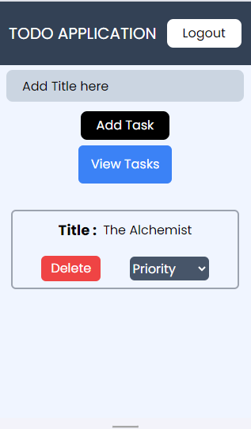
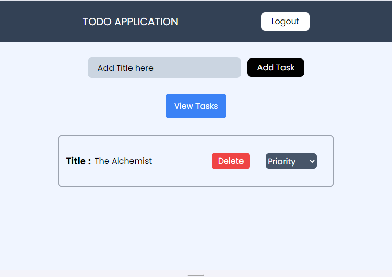

# React + Vite

This template provides a minimal setup to get React working in Vite with HMR and some ESLint rules.

Currently, two official plugins are available:

- [@vitejs/plugin-react](https://github.com/vitejs/vite-plugin-react/blob/main/packages/plugin-react/README.md) uses [Babel](https://babeljs.io/) for Fast Refresh
- [@vitejs/plugin-react-swc](https://github.com/vitejs/vite-plugin-react-swc) uses [SWC](https://swc.rs/) for Fast Refresh

## Project Running Steps

- First, ensure that Node.js and npm (or yarn) are installed on your machine.
- Clone the repository to your local machine.
- Run the project using one of the following commands:
  npm run dev

- Login to the site by using email id and password.Then you will redirected to the home page.
- click on the view Task button to view all tasks.
- Enter a new task Title in the input click on add Task button to add task
- Click on Delete button to delete the task.
- select the priority of the task to high,medium,low it will change the background color of the perticular task.

## Project Screenshot

## Mobile view

## Tablet view
